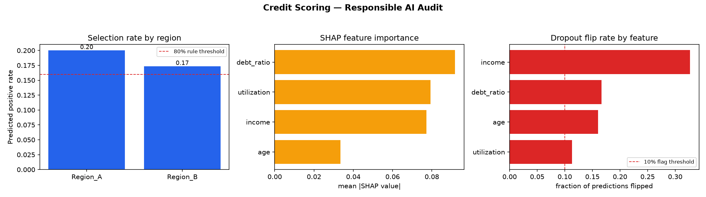

# responsible-ai-finance

[](https://github.com/anil-turan/responsible-ai-finance-framework/actions/workflows/tests.yml)
[](LICENSE)

A lightweight, dependency-light **fairness + explainability + robustness
audit framework** for classification models used in financial services.

```python
from responsible_ai_finance import audit

report = audit(model, X_test, y_test, sensitive_features=X_test["region"], model_name="credit-scorer-v3")
print(report.to_markdown())
print(report.flags())  # short list of governance red flags, if any
```

## Why this exists

Every fairness/explainability/robustness check a model-risk reviewer asks
for lives in a different library (Fairlearn, AIF360, SHAP, LIME, Evidently)
with a different API. This package wraps the three checks that come up
constantly in financial-services model governance — group fairness, SHAP
explainability, and perturbation robustness — behind **one function call**
that returns **one report object**, in pure numpy/pandas/scikit-learn/shap
(no TensorFlow, no heavyweight fairness-library dependency tree).

It deliberately reimplements the fairness metrics from their published
definitions (see `src/responsible_ai_finance/fairness.py` docstring for
references) rather than wrapping Fairlearn/AIF360, so every number the
framework reports is auditable in ~100 lines of code — appropriate for a
tool whose whole purpose is auditability.

## What it checks

| Category | Metrics |
|---|---|
| **Fairness** | Demographic parity difference/ratio, equalized odds (TPR/FPR difference), disparate impact ratio + 80% rule pass/fail, per-group breakdown |
| **Explainability** | SHAP-based global feature importance, local-fidelity check (does the additive SHAP decomposition actually reconstruct the model's own output?) |
| **Robustness** | Prediction flip rate under small Gaussian noise; per-feature "what if this field arrives as zero/missing" flip rate |

`AuditReport.flags()` distills all three into a short list only when a
threshold is actually breached — the point is a reviewer reads 2 lines, not
3 dashboards, on the happy path.

## Install

```bash
pip install responsible-ai-finance
```

Or, from source for development:

```bash
git clone https://github.com/anil-turan/responsible-ai-finance-framework
cd responsible-ai-finance-framework
python3 -m venv .venv && source .venv/bin/activate
pip install -e ".[dev]"
```

## Case studies

Three notebooks, each trained on synthetic data and audited end to end —
see [`case_studies/`](case_studies/README.md) for the full results and all
three figures:

1. Credit default scoring (region as protected attribute)
2. Motor insurance claim-risk pricing (age band as protected attribute)
3. AML alert escalation (customer segment as protected attribute)



Each figure is generated directly from the framework's own output (selection
rate by group, SHAP feature importance, and dropout robustness) — not a
mockup.

## Tests

```bash
python -m pytest tests/ -v --cov=src --cov-report=term-missing
```

12/12 tests passing, 95% line coverage, run against a RandomForest model
trained on synthetic data with a deliberately baked-in fairness gap (see
`tests/conftest.py`) so the fairness tests exercise real detection logic,
not just "does it run."

## Design notes / limitations

- **Binary classification only** in this version — the metrics generalise to
  multi-class with more group-level bookkeeping, but that's out of scope
  for v0.1.
- **Group fairness, not individual fairness.** The framework answers "are
  outcomes similar across groups?", not "are similar individuals treated
  similarly?" — a materially different (and harder) question.
- **SHAP's `Explainer` auto-selection** falls back to a slower
  permutation-based explainer for non-tree models; `sample_size` exists to
  keep that tractable, at the cost of exact reproducibility across sample
  sizes.
- Passing the 80% disparate-impact rule does not mean a protected-attribute
  proxy isn't present in the data — see the case-studies README for a
  concrete illustration of this from the credit-scoring notebook.

## AI tools used

Built with Claude Code (Claude Sonnet 5): the fairness/explainability/
robustness modules, the `AuditReport` API, the pytest suite, and the three
case-study notebooks (generated programmatically via `nbformat` and executed
for real via `jupyter nbconvert --execute` — outputs in `case_studies/*.ipynb`
are genuine run results, not hand-written) were all written by Claude from a
project brief. A human reviewed the metric definitions, ran the full test
suite, and inspected the executed notebook outputs before committing.

## License

MIT — see `LICENSE`.
