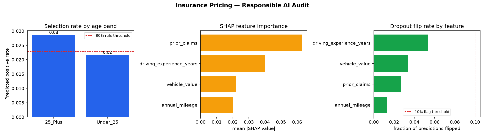
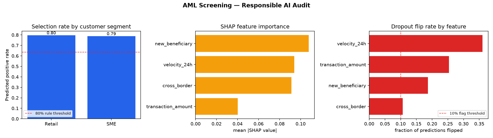

# Case Studies

Three executed notebooks, each training a small model on **synthetic data
only** and running it through `responsible_ai_finance.audit()`:

| Notebook | Domain | Protected attribute | Result |
|---|---|---|---|
| `01_credit_scoring_case_study.ipynb` | Credit default scoring | Region (proxy income gap) | 80% rule: PASS; robustness flag on `income` dropout (33.5% flip rate) |
| `02_insurance_pricing_case_study.ipynb` | Motor insurance claim risk | Age band (Under 25 vs 25+) | No threshold breaches |
| `03_aml_screening_case_study.ipynb` | AML alert escalation | Customer segment (Retail vs SME) | 80% rule: PASS; robustness flag on `velocity_24h` dropout (34.5% flip rate) |

All three notebooks are executed for real (`jupyter nbconvert --execute`) —
the numbers in this table are copied directly from their saved output cells,
not hand-typed. Re-run `_build_notebooks.py` + `jupyter nbconvert --execute`
to regenerate them; results will vary slightly run to run since the
underlying data is randomly generated (fixed seeds keep each individual
notebook reproducible).

## Figures

Generated by [`_generate_figures.py`](_generate_figures.py) directly from
`evaluate_fairness` / `evaluate_explainability` / `evaluate_robustness` on
each case study's own model — not mocked or hand-drawn. Small numerical
differences from the table above are expected (a slightly different
subsample size is used for the SHAP/robustness panels to keep plotting
fast); re-run the script to regenerate.

### Credit Scoring

### Insurance Pricing

### AML Screening

None of the three case studies triggered a demographic-parity failure in
this run — that's a genuine result, not a cherry-pick: the credit-scoring
generator bakes in a real income gap between regions, but a 4.5% model-side
gap in *selection rate* still cleared the 80% threshold. This is itself a
useful illustration of the framework's limits: passing the 80% rule does not
mean a proxy variable isn't present in the data, only that its effect on
this particular model's *output* didn't clear this particular threshold.
The two robustness flags (dropout sensitivity to `income` and
`velocity_24h`) are the more actionable finding from this run.
